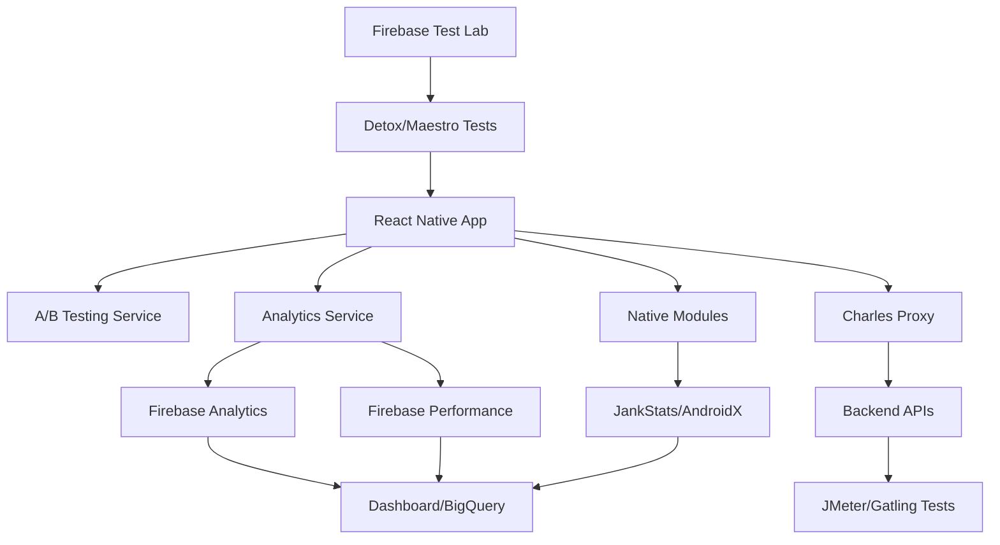

# Ferramentas Externas para Testes A/B e Performance

Este documento explica como as ferramentas mencionadas originalmente se encaixariam em um projeto completo de React Native para testes A/B e monitoramento de performance.

## 🔥 Firebase Performance Monitoring

### Como se encaixa no projeto:
- **Automatização do `logRenderTime`**: O Firebase Performance Monitoring automatizaria a coleta de métricas de performance que atualmente fazemos manualmente com nosso hook `useRenderTime`.
- **Métricas automáticas**: Coleta automaticamente tempo de inicialização da app, rendering de telas, consumo de CPU e memória.
- **Traces customizados**: Permite criar traces personalizados para medir operações específicas (ex: tempo de carregamento de posts).

### Implementação:
```javascript
import perf from '@react-native-firebase/perf';

// Trace customizado
const trace = await perf().startTrace('load_posts');
await loadPosts();
trace.stop();
```

---

## 📱 JankStats / AndroidX Tracing

### Como se encaixa no projeto:
- **Detecção de "jank"**: Identifica quando a UI trava ou fica lenta (frames perdidos).
- **Métricas nativas**: Coleta dados diretamente do sistema Android sobre performance da UI.
- **Integração via módulo nativo**: Precisaria de um módulo nativo customizado para enviar os dados para o JavaScript.

### O que mede:
- Frames perdidos (dropped frames)
- Tempo de renderização por frame
- Stuttering na UI
- Performance de animações

---

## ⚡ JMeter / Gatling

### Como se encaixa no projeto:
- **Testes de carga no backend**: Testa a capacidade do servidor que fornece dados para a aplicação.
- **Simulação de usuários**: Simula milhares de usuários fazendo requisições simultâneas.
- **Não testa o app diretamente**: Testa a infraestrutura por trás da aplicação.

### Cenários de teste:
```gherkin
Cenário: Pico de tráfego
- 1000 usuários simultâneos
- Carregando feed de posts
- Criando novos posts
- Curtindo e comentando
```

### Métricas:
- Tempo de resposta das APIs
- Throughput (requisições/segundo)
- Taxa de erro
- Recursos do servidor (CPU, memória)

---

## 🔍 Charles Proxy

### Como se encaixa no projeto:
- **Simulação de rede lenta**: Testa como a aplicação se comporta em conexões 3G/4G lentas.
- **Inspeção de tráfego**: Visualiza todas as requisições HTTP/HTTPS entre app e servidor.
- **Debug de APIs**: Identifica problemas de performance em chamadas específicas.

### Funcionalidades para nosso projeto:
```javascript
// Simular rede lenta
Charles Proxy -> Throttle Settings
- 3G: 384 kbps down, 128 kbps up
- Edge: 240 kbps down, 200 kbps up

// Breakpoints para debug
- Pausar requisições específicas
- Modificar responses da API
- Simular erros de rede
```

---

## 🧪 Firebase Test Lab

### Como se encaixa no projeto:
- **Testes automatizados**: Executa testes de UI (Detox, Maestro) em dispositivos reais.
- **Compatibilidade**: Testa em diferentes modelos de Android e iOS.
- **Testes de A/B**: Valida se ambas variantes funcionam corretamente em todos os dispositivos.

### Tipos de teste:
```javascript
// Teste de fumaça para ambas variantes
describe('A/B Test Variants', () => {
  test('Variante A - Navigation works', async () => {
    // Força variante A
    await setABVariant('A');
    await expect(element(by.id('home-tab'))).toBeVisible();
    await expect(element(by.id('notifications-tab'))).not.toExist();
  });

  test('Variante B - Navigation with notifications', async () => {
    // Força variante B  
    await setABVariant('B');
    await expect(element(by.id('notifications-tab'))).toBeVisible();
  });
});
```

---

## 🏗️ Arquitetura Completa

### Como tudo se conecta:



### Fluxo de dados:
1. **App executa** → Determina variante A/B
2. **Usuário interage** → Eventos são logados
3. **Performance é medida** → Automaticamente pelo Firebase + JankStats
4. **Dados são enviados** → Para Firebase Analytics
5. **APIs são testadas** → JMeter valida performance do backend
6. **Qualidade é garantida** → Test Lab executa testes automatizados

---

## 📊 Métricas Chave para Decisão do A/B Test

### Variante A vs Variante B:
- **Tempo de sessão**: Usuários ficam mais tempo na app?
- **Engajamento**: Mais cliques, likes, posts?
- **Retenção**: Voltam nos próximos dias?
- **Performance**: App fica mais lenta com aba extra?
- **Crash rate**: Variante B introduz bugs?

### Significância estatística:
- Mínimo 1000 usuários por variante
- Rodar por pelo menos 2 semanas
- Confiança de 95%
- Poder estatístico de 80%

---

## 🚀 Implementação Gradual

### Fase 1 - Básico:
- ✅ A/B Testing implementado
- ✅ Analytics básico implementado
- ✅ Dashboard interno

### Fase 2 - Automação:
- Firebase Performance integration
- Automated crash reporting
- API monitoring

### Fase 3 - Avançado:
- JankStats integration
- Load testing setup
- Comprehensive test automation

### Fase 4 - Enterprise:
- Real-time monitoring
- Predictive analytics
- Auto-rollback em caso de problemas